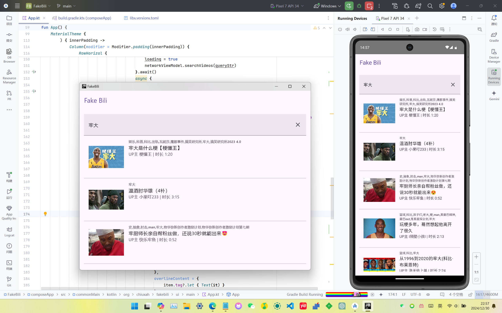

# FakeBili
## 说明
Kotlin跨平台+Ktor框架入门练习
## 截图

## 平台
Win、Android

无iOS（由于无MacOS环境）（不共享UI）
## 功能
本人练手用，简单用Ktor实现检索哔哩哔哩视频，点击跳转浏览器播放
## 入门心得
新的Gradle依赖让人有点乱，在android那边都是直接复制粘贴 im "com.xxx:1.x" 就行，这里不是这样的，熟悉了好一会，gradle/libs.versions.toml 上大分，着重看一下这里

无法共享的代码，需要用except 分别在不同平台实现，android studio会给提示

添加gradle配置 composeApp:run ,即可跑Win

即使win可以跑，有时候android那边也会报错，按日志修就行

我习惯android开发，开发网络层时也参考android开发分层的思路，不知道对不对...

shared文件夹没改动，应该是共享给iOS用的，没苹果本子搞不来
## 依赖
[Ktor](https://github.com/ktorio/ktor)

[Compose ImageLoader](https://github.com/qdsfdhvh/compose-imageloader)

## Other
This is a Kotlin Multiplatform project targeting Android, iOS, Desktop.

* `/composeApp` is for code that will be shared across your Compose Multiplatform applications.
  It contains several subfolders:
  - `commonMain` is for code that’s common for all targets.
  - Other folders are for Kotlin code that will be compiled for only the platform indicated in the folder name.
    For example, if you want to use Apple’s CoreCrypto for the iOS part of your Kotlin app,
    `iosMain` would be the right folder for such calls.

* `/iosApp` contains iOS applications. Even if you’re sharing your UI with Compose Multiplatform, 
  you need this entry point for your iOS app. This is also where you should add SwiftUI code for your project.

* `/shared` is for the code that will be shared between all targets in the project.
  The most important subfolder is `commonMain`. If preferred, you can add code to the platform-specific folders here too.

Learn more about [Kotlin Multiplatform](https://www.jetbrains.com/help/kotlin-multiplatform-dev/get-started.html)…

